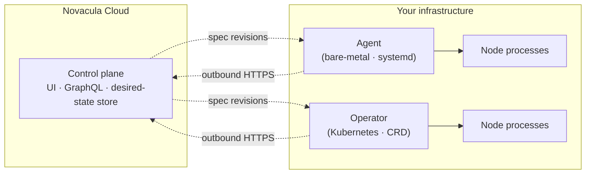

Novacula is the blockchain node infrastructure platform for running your own full nodes for RPC. Deploy, configure, monitor, and operate JSON-RPC, WebSocket, and gRPC endpoints on bare-metal or Kubernetes you control — no third-party gateway, no traffic leaving your network.

**On-premise from day one, in every deployment mode.** Managed **Cloud** keeps the control plane on Novacula's side while the node hardware remains yours; fully [Self-hosted](/self-hosted/introduction) puts the entire stack inside your network. Either way, blockchain processes and their data never leave hardware you own. The control plane orchestrates; your servers serve.

<CardGroup cols={3}>
  <Card title="Quickstart" icon="rocket" href="/docs/get-started/quickstart">
    From zero to a syncing node in under 10 minutes.
  </Card>
  <Card title="Key concepts" icon="book" href="/docs/get-started/key-concepts">
    The mental model in five terms.
  </Card>
  <Card title="Architecture" icon="diagram-project" href="/docs/platform/architecture">
    How the control plane, executors, and adapters fit together.
  </Card>
  <Card title="Supported chains" icon="link" href="/docs/chains/overview">
    Bitcoin, BSC, Ethereum, Igra, Ink, Monad, Sui, Tron.
  </Card>
  <Card title="Recipes" icon="book" href="/recipes/provision-on-kubernetes">
    Provisioning playbooks for K8s and bare-metal.
  </Card>
  <Card title="Self-hosted" icon="warehouse" href="/self-hosted/introduction">
    Run the entire stack inside your network.
  </Card>
</CardGroup>

## How it fits together

Executors run on your side. They open outbound HTTPS to the control plane, fetch the latest spec revisions for the nodes they own, and reconcile the underlying processes — never the other way around. See [Architecture](/docs/platform/architecture) for the full lifecycle.

## Two execution backends

Novacula nodes run through one of two backends, both implementing the same `ChainAdapter` interface:

- **[Agent](/docs/executors/agent-bare-metal)** — a Linux daemon that manages node processes as `systemd` services. Use it on bare-metal or virtual machines.
- **[Operator](/docs/executors/operator-kubernetes)** — a Kubernetes controller that materializes nodes as `ConfigMap` + `StatefulSet`. Use it on K8s clusters.

Pick the one that matches your infrastructure — or run both side-by-side under the same organization.

## Outbound-only

Executors always initiate connections to the control plane over HTTPS. The control plane never reaches into your infrastructure, so you don't need to expose any inbound ports, open firewall rules, or run VPN tunnels.

<Info>
Need a programmatic interface for the platform? Authenticate with an [API key](/docs/account/api-keys) — every UI action has a GraphQL counterpart.
</Info>
